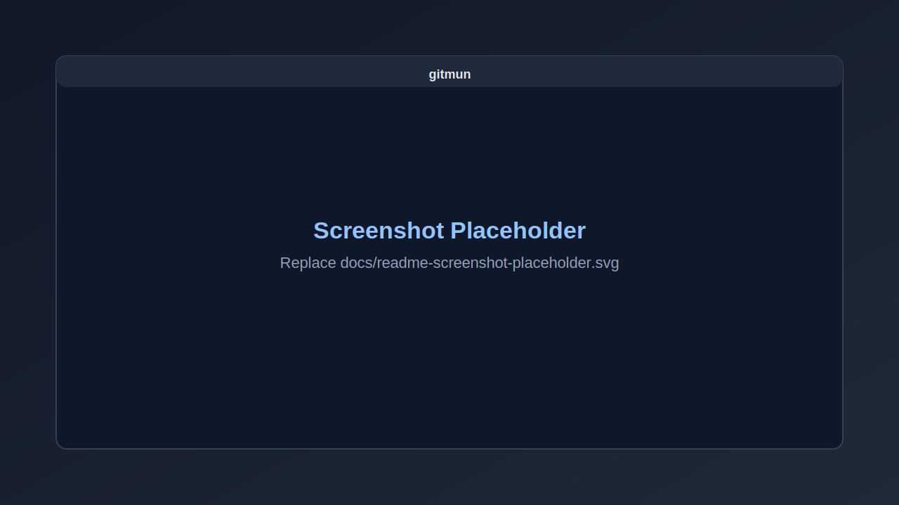

# gitmun

gitmun is a desktop Git client built with Tauri (Rust + React/TypeScript).



## Get gitmun

- Download info: https://gitmun.org
- Flatpak: https://gitmun.org

## What it does

- Open local repositories and inspect status, branches, tags, remotes, and history.
- Stage, commit, fetch, pull, and push without leaving the app.
- View operation output in the built-in Result Log.

## Local development

Prerequisites:

- Node.js + npm
- Rust toolchain
- Tauri prerequisites for your OS
- `git` on PATH

Install dependencies:

```bash
npm install
```

Run in development:

```bash
npm run tauri dev
```

Build desktop bundles:

```bash
npm run tauri build
```

Linux-only helper setup (if needed):

```bash
npm run linux:setup
```

## Notes

- gitmun uses your system Git authentication setup (SSH agent, credential helpers, HTTPS tokens).
- Settings are stored in a JSON config file; the path is shown in the Settings window.
