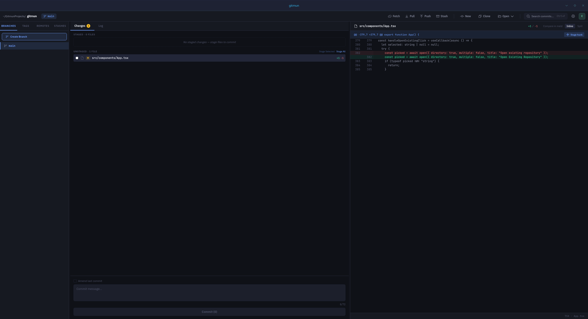

# Gitmun

Gitmun is a crossplatform desktop Git client built with Tauri (Rust + React/TypeScript).



## Get Gitmun

| Source | Platform | Link |
| --- | --- | --- |
| Releases | Cross-platform | https://github.com/cst8t/gitmun/releases |
| openSUSE Build Service | DEB & RPM (Various Linux Distros) | https://software.opensuse.org/download.html?project=home%3Acst8t%3Agitmun&package=gitmun|
| AUR | Arch Linux | https://aur.archlinux.org/packages/gitmun-bin |
| Flathub (Flatpak) | Linux | Coming Soon |
| Winget | Windows | ```winget install -e --id cst8t.gitmun``` |
| Microsoft Store | Windows | https://apps.microsoft.com/detail/9nbvnckh5j9v |

## What it does

- Open local repositories and inspect status, branches, tags, remotes, and history.
- Stage, commit, fetch, pull, and push without leaving the app.
- View operation output in the built-in Result Log.

## Local development

Prerequisites:

- Node.js + npm
- Rust toolchain
- Tauri prerequisites for your OS
- `git` on PATH

Install dependencies:

```bash
npm install
```

Run in development:

```bash
npm run tauri dev
```

Build desktop bundles:

```bash
npm run tauri build
```

Linux-only helper setup (if needed):

```bash
npm run linux:setup
```

## Notes

- Gitmun uses your system Git authentication setup (SSH agent, credential helpers, HTTPS tokens).
- Settings are stored in a JSON config file; the path is shown in the Settings window.
- macOS bundles are built in CI but are currently untested because I do not have access to macOS hardware. Any help testing macOS releases is greatly appreciated.
